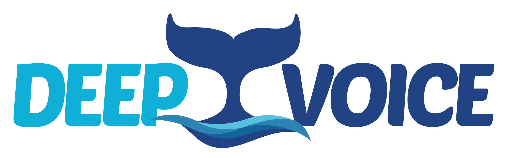

## Deep Learning Framework for Bioacoustics
Soundbay is an intuitive and comprehensive Python-based framework for training deep learning models and apply them in bioacoustic research. We focus our efforts on marine mammals communication, however, we believe the framework is applicable for a broader scope.

## Installation

### Cloning the repo

```
$ git clone https://github.com/mosheman5/soundbay.git
$ cd soundbay
```

### Dependencies
The needed packages to run the framework are given in ```requirements.txt```

Using a virtual enviroment is recommended:
```
virtualenv -p python3 .venv
source .venv/bin/activate
pip install -r requirements.txt
```
The framework uses torch, torchaudio and torchvision which can be installed manually, please refer the [guide](https://pytorch.org/get-started/locally/) 

## Usage

### Experiment management philosophy 
The framework utilizes Hydra package for configuration and experiments mangement, we highly encourage you to refer their [tutorials](https://hydra.cc/docs/tutorials/intro/)
We provide modular recipes inside [conf](src/conf/) to run experiments and to reproduce well established algorithms.
We have three levels of parameters control:
- run-summarizing config files
- parameters groups, represented by a row in the defaults of the config file
- the lowest level of parameters, detailed in the parameter group config file.

Each raw in a run configuration file calls a (hopefully) stand-alone group of parameters which can be switched to another one easily, enabling us to run many different experiments without boilerplate.


### Data structure
Path to the datafolder should be passed as an argument for training. The data folder or subfolders should contain `.wav` files. 
A `.csv` file should accompany the data, serve as metadata from which the training pipeline takes samples with their corresponding labels.
A toy example is available for [data](tests/data) and the respective [annotations](tests/annotations/samples_annotations.csv)

### Training Example

Running train and inference commands are done from src.
Run the following command for a toy problem training:
```
cd src
python train.py
```
The toy run uses the default configuration with its default parameters. 
Parameters overriding and config file changes are available, please refer Hydra tutorial for more details.
For example,
```
cd src
python train.py --config-name runs/main_unit_norm data.batch_size=8 optim=jasco_vgg_19 experiment.manual_seed=4321
```
Runs training with a config file under conf/runs/main_unit_norm, overriding the batch_size parameter in data, manual_seed in experiment, and the group parameter optim with jasco_vgg_19 instead of the default. 

### inference Example
To run the predictions of the model on a single audio file use the inference script:
```
cd src
python inference.py --config-name runs/inference_single_audio checkpoint.path=<PATH/TO/MODEL> data.test_dataset.file_path=<PATH/TO/FILE>
```
To run the predictions of the model on a labeled test partition use:
```
cd src
python inference.py --config-name runs/main_inference checkpoint.path=<PATH/TO/MODEL> data.test_dataset.data_path=<PATH/TO/DATA> data.test_dataset.metadata_path=<PATH/TO/METADATA> 
```

## License

This library is licensed under the Apache 2.0 License.
